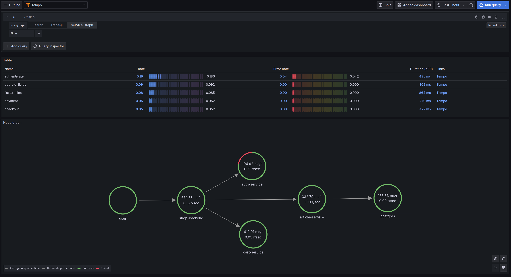

## Configuring data export from **OpenTelemetry Collector** to **Tempo** using **TLS**

* In this example, I inserted the `ip`-addresses of the `localhost` and `my` computer
* Insert in `otel-collector.yaml:exporters.otlp.endpoint` target `ip`-address

### Follow the commands below

Insert data from `server.cnf` if necessary

1. Creating a root certificate
```shell
openssl genrsa -out ca.key 2048
openssl req -x509 -new -nodes -key ca.key -sha256 -days 365 -out ca.crt
```

2. Creating a server certificate
```shell
openssl genrsa -out server.key 2048
openssl req -new -key server.key -out server.csr -config server.cnf
openssl x509 -req -in server.csr -CA ca.crt -CAkey ca.key -CAcreateserial -out server.crt -days 365 -sha256 -extfile server.cnf -extensions req_ext
```

3. Creating a client certificate
```shell
openssl genrsa -out client.key 2048
openssl req -new -key client.key -out client.csr
openssl x509 -req -in client.csr -CA ca.crt -CAkey ca.key -CAcreateserial -out client.crt -days 365 -sha256
```

4. Start with `just up`
5. Open [Grafana](http://127.0.0.1:3000/explore?schemaVersion=1&panes=%7B%22vi4%22:%7B%22datasource%22:%22tempo%22,%22queries%22:%5B%7B%22refId%22:%22A%22,%22datasource%22:%7B%22type%22:%22tempo%22,%22uid%22:%22tempo%22%7D,%22queryType%22:%22traceql%22,%22limit%22:20,%22tableType%22:%22traces%22,%22query%22:%22%7B%7D%22%7D%5D,%22range%22:%7B%22from%22:%22now-1h%22,%22to%22:%22now%22%7D%7D%7D&orgId=1) and explore **traces**
6. Stop with `just down`


### Service Graph

**Tempo** will help you generate `metrics` for **Prometheus** from `traces` and build a **graph of services** based on them


